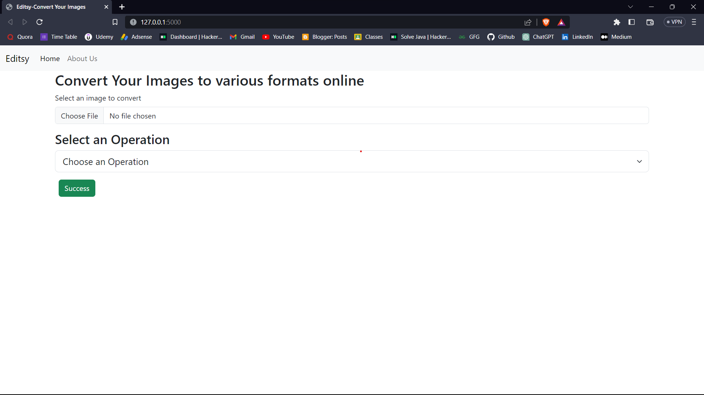
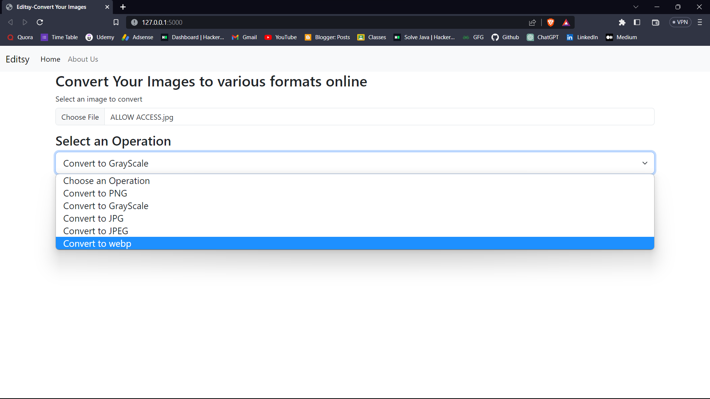
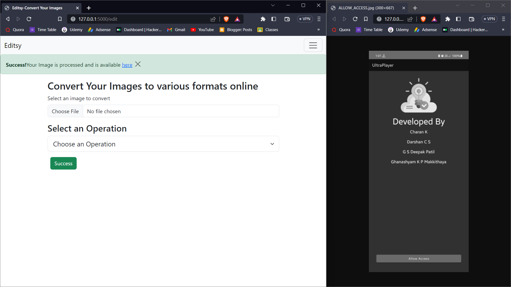

# Image-Format-Converter-using-Flask
A simple web application to convert image into various formats like jpg, jpeg, webp, png, grayscale. 

## Screenshots

### 1. Homepage

### 2. Options

### 3. Success

